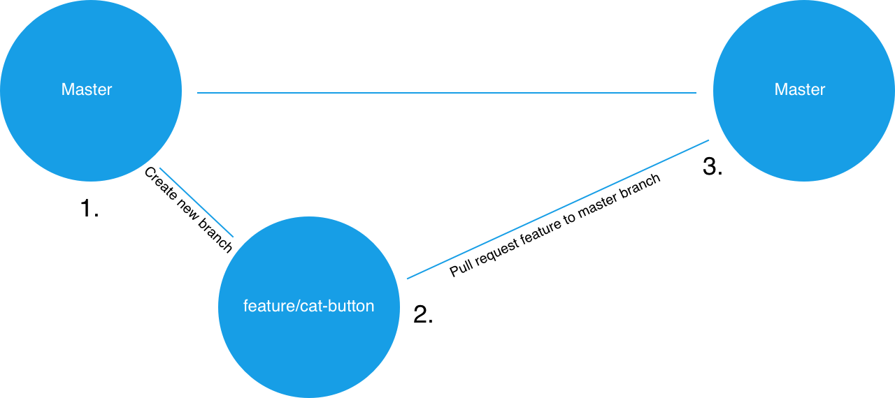

### Adding Collaborators to a Repository

* In this activity, each project group will create a project repo and invite all group member as collaborators.

* **Instructions**: 

```
* One group member should create a new Github repository.

* From the repo's main page, click the "Settings" tab.

* Once in the repo's settings, select the "Collaborators" menu item on the left.

* From the "Collaborators" page invite your group members to be project collaborators by entering their Github usernames one at a time.

* Each invited group member should receive an email they must open to accept the invitation.
```

### Pull Requests and Code Review

* When working with others on the same repo, it's important to make sure that all of the new code gets reviewed by at least one other team member before getting merged into the master branch.

  * Reviewing new code decreases the chances that a breaking change will accidentally be introduced into the master branch.

  * Code review helps group members who didn't write the code understand how it works.

* The next step of setting up our project repos for group collaboration is to protect the master branch.

  * Protecting the master branch means we will configure the repo to prohibit any team members from pushing code up into master directly or merging it in without another team member's review.

### Protect Master Branch

* In this activity groups will protect their master branches.

* Refer to `08-project-1/02-Stu_Protect-Master`, which contains the following instructions:

* **Instructions**: 

```
* Only one member per project group needs to complete this activity. 

* Navigate back to the repo's "Settings" page and then select "Branches" from the left sidebar.

* Under "Branch Protection Rules" select "master" from the dropdown.

* You should be presented with some options, check off the following:

  * "Protect this branch"

  * "Require pull request reviews before merging"

  * "Include administrators"

* If completed successfully, no one should be able to push directly to the master branch. Instead, all changes must be made in the form of pull requests that are to be reviewed by another group member.
```

### Branching

* Every Git repo starts off with a master branch. This is there to hold the production version of the repo's code. But when we want to work on the code, we start by creating a new feature branch off of master.

  * If we create a new branch from master, it essentially creates a self-contained copy of all of the master branch's code for us to work in.

* When we're satisfied with our work in the new feature branch, we submit a pull request from the feature branch to the master branch.

  * A pull request is a request to merge the diffs or changes from the source branch (the feature branch) to the target branch (master).

  * With the way our repos are set up now, another group member must look at and approve the pull request before its changes can be merged into master.

* Once a feature branch has been merged into master, we delete it and then check back out to the master branch. From there, we'd check back out to a new feature branch and repeat the process for each feature we add.

* Slack out the following image for students to have as a visual aid:

  